## Security

See [CONTRIBUTING](CONTRIBUTING.md#security-issue-notifications) for more information.

## License

This library is licensed under the MIT-0 License. See the LICENSE file.

# **Orchestrate Jenkins Workloads using Dynamic Pod Autoscaling with Amazon EKS**

This blog post will demonstrate how to leverage [Jenkins](https://www.jenkins.io/) with [Amazon Elastic Kubernetes Service (EKS)](https://docs.aws.amazon.com/eks/latest/userguide/what-is-eks.html) by running a Jenkins Manager within an EKS pod. In doing so, we can run Jenkins workloads by allowing Amazon EKS to spawn dynamic Jenkins Agent(s) in order to perform application and infrastructure deployment. Traditionally, customers will setup a Jenkins Manager-Agent architecture that contains a set of manually added nodes with no autoscaling capabilities. Implementing this strategy will ensure that a robust approach optimizes the performance with the right-sized compute capacity and work needed to successfully perform the build tasks.

In setting up our Amazon EKS cluster with Jenkins, we’ll utilize the [`eksctl`](https://docs.aws.amazon.com/eks/latest/userguide/eksctl.html) simple CLI tool for creating clusters on EKS. Then, we’ll build both the Jenkins Manager and Jenkins Agent image. Afterward, we’ll run a container deployment on our cluster to access the Jenkins application and utilize the dynamic Jenkins Agent pods to run pipelines and jobs.

## Solution Overview

The architecture below illustrates the execution steps.

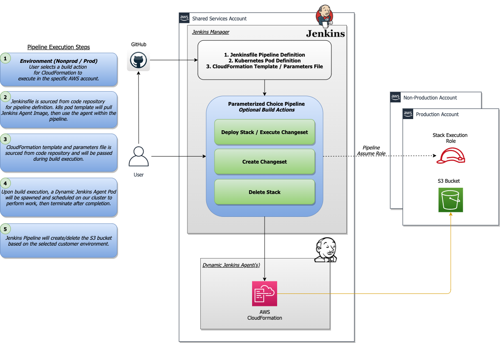
*Figure 1. Solution overview diagram*

Disclaimer(s): *(Note: This Jenkins application is not configured with a persistent volume storage. Therefore, you must establish and configure this template to fit that requirement).*

To accomplish this deployment workflow, we will do the following:

- Centralized Shared Services account
  1. Deploy the Amazon EKS Cluster into a Centralized Shared Services Account.
  2. Create the Amazon ECR Repository for the Jenkins Manager and Jenkins Agent to store docker images.
  3. Deploy the kubernetes manifest file for the Jenkins Manager.

- Target Account(s)
  1. Establish a set of [AWS Identity and Access Management (IAM)](https://docs.aws.amazon.com/IAM/latest/UserGuide/tutorial_cross-account-with-roles.html) roles with permissions for cross-across access from the Share Services account into the Target account(s).

- Jenkins Application UI
  1. Jenkins Plugins - Install and configure the [Kubernetes Plugin](https://plugins.jenkins.io/kubernetes/) and [CloudBees AWS Credentials Plugin](https://plugins.jenkins.io/aws-credentials/) from Manage Plugins *(you will not have to manually install this since it will be packaged and installed as part of the Jenkins image build).*
  2. Jenkins Pipeline Example—Fetch the Jenkinsfile to deploy an S3 Bucket with CloudFormation in the Target account using a Jenkins parameterized pipeline.

## Prerequisites

The following is the minimum requirements for ensuring this solution will work.

- Account Prerequisites
  - Shared Services Account: The location of the Amazon EKS Cluster.
  - Target Account: The destination of the CI/CD pipeline deployments.

- Build Requirements
  - [AWS CLI](https://docs.aws.amazon.com/cli/latest/userguide/cli-chap-install.html)
  - [Docker CLI](https://docs.docker.com/get-docker/) — *Note: The docker engine must be running in order to build images.*
  - [aws-iam-authenticator](https://docs.aws.amazon.com/eks/latest/userguide/install-aws-iam-authenticator.html)
  - [kubectl](https://docs.aws.amazon.com/eks/latest/userguide/install-kubectl.html)
  - [eksctl](https://github.com/weaveworks/eksctl)
  - Configure your [AWS credentials](https://docs.aws.amazon.com/cli/latest/userguide/cli-configure-files.html) with the associated region.
  - Verify if the build requirements were correctly installed by checking the version.
  - [Create an EKS Cluster using eksctl.](https://github.com/aws-samples/jenkins-cloudformation-deployment-example/blob/main/EKS.md)
  - Verify that EKS nodes are running and available.
  - [Create an AWS ECR Repository for the Jenkins Manager and Jenkins Agent.](https://github.com/aws-samples/jenkins-cloudformation-deployment-example/blob/main/ECR.md)

## Clone the Git Repository

```bash
~ git clone https://github.com/aws-samples/jenkins-cloudformation-deployment-example.git
```

## Security Considerations

This blog provides a high-level overview of the best practices for cross-account deployment and isolation maintenance between the applications. We evaluated the cross-account application deployment permissions and will describe the current state as well as what to avoid. As part of the security best practices, we will maintain isolation among multiple apps deployed in these environments, e.g., Pipeline 1 does not deploy to the Pipeline 2 infrastructure.

### Requirement

A Jenkins manager is running as a container in an EC2 compute instance that resides within a Shared AWS account. This Jenkins application represents individual pipelines deploying unique microservices that build and deploy to multiple environments in separate AWS accounts. The cross-account deployment utilizes the target AWS account admin credentials in order to do the deployment.

This methodology means that it is not good practice to share the account credentials externally. Additionally, the deployment errors risk should be eliminated and application isolation should be maintained within the same account.

Note that the deployment steps are being run using AWS CLIs, thus our solution will be focused on AWS CLI usage.

The risk is much lower when utilizing CloudFormation / CDK to conduct deployments because the AWS CLIs executed from the build jobs will specify stack names as parametrized inputs and the very low probability of stack-name error. However, it remains inadvisable to utilize admin credentials of the target account.

### Best Practice — *Current Approach*

We utilized cross-account roles that can restrict unauthorized access across build jobs. Behind this approach, we will utilize the assume-role concept that will enable the requesting role to obtain temporary credentials (from the STS service) of the target role and execute actions permitted by the target role. This is safer than utilizing hard-coded credentials. The requesting role could be either the inherited EC2 instance role OR specific user credentials. However, in our case, we are utilizing the inherited EC2 instance role.

For ease of understanding, we will refer the target-role as execution-role below.

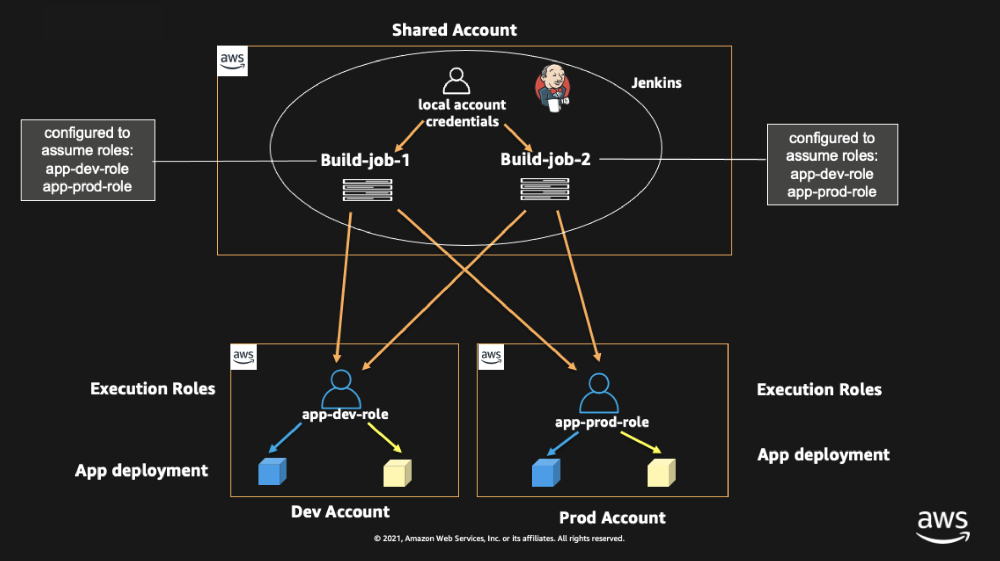
*Figure 2. Current approach*

- As per the security best practice of assigning minimum privileges, we must first create execution role in IAM in the target account that has deployment permissions (either via CloudFormation OR via CLI’s), e.g., app-dev-role in Dev account and app-prod-role in Prod account.

- For each of those roles, we configure a trust relationship with the parent account ID (Shared Services account). This enables any roles in the Shared Services account (with assume-role permission) to assume the execution-role and deploy it on respective hosting infrastructure, e.g., the app-dev-role in Dev account will be a common execution role that will deploy various apps across infrastructure.

- Then, we create a local role in the Shared Services account and configure credentials within Jenkins to be utilized by the Build Jobs. Provide the job with the assume-role permissions and specify the list of ARNs across every account. Alternatively, the inherited EC2 instance role can also be utilized to assume the execution-role.

### Create Cross-Account IAM Roles

[Cross-account IAM roles](https://docs.aws.amazon.com/IAM/latest/UserGuide/tutorial_cross-account-with-roles.html#tutorial_cross-account-with-roles-prereqs) allow users to securely access AWS resources in a target account while maintaining the observability of that AWS account. The cross-account IAM role includes a trust policy allowing AWS identities in another AWS account to assume the given role. This allows us to create a role in one AWS account that delegates specific permissions to another AWS account.

- Create an IAM role with a common name in each target account. The role name we’ve created is `AWSCloudFormationStackExecutionRole`. The role must have permissions to perform CloudFormation actions and any actions regarding the resources that will be created. In our case, we will be creating an S3 Bucket utilizing CloudFormation.

- This IAM role must also have an established trust relationship to the Shared Services account. In this case, the Jenkins Agent will be granted the ability to assume the role of the particular target account from the Shared Services account.

- In our case, the IAM entity that will assume the `AWSCloudFormationStackExecutionRole` is the EKS Node Instance Role that associated with the EKS Cluster Nodes.

```json
{
    "Version": "2012-10-17",
    "Statement": [
        {
            "Effect": "Allow",
            "Action": [
                "cloudformation:CreateUploadBucket",
                "cloudformation:ListStacks",
                "cloudformation:CancelUpdateStack",
                "cloudformation:ExecuteChangeSet",
                "cloudformation:ListChangeSets",
                "cloudformation:ListStackResources",
                "cloudformation:DescribeStackResources",
                "cloudformation:DescribeStackResource",
                "cloudformation:CreateChangeSet",
                "cloudformation:DeleteChangeSet",
                "cloudformation:DescribeStacks",
                "cloudformation:ContinueUpdateRollback",
                "cloudformation:DescribeStackEvents",
                "cloudformation:CreateStack",
                "cloudformation:DeleteStack",
                "cloudformation:UpdateStack",
                "cloudformation:DescribeChangeSet",
                "s3:PutBucketPublicAccessBlock",
                "s3:CreateBucket",
                "s3:DeleteBucketPolicy",
                "s3:PutEncryptionConfiguration",
                "s3:PutBucketPolicy",
                "s3:DeleteBucket"
            ],
            "Resource": "*"
        }
    ]
}
```

## Build Docker Images

Build the custom docker images for the Jenkins Manager and the Jenkins Agent, and then push the images to AWS ECR Repository. Navigate to the `docker/` directory, then execute the command according to the required parameters with the AWS account ID, repository name, region, and the build folder name `jenkins-manager/` or `jenkins-agent/` that resides in the current docker directory. The custom docker images will contain a set of starter package installations.

- [Build and push the Jenkins Manager and Jenkins Agent docker images to the AWS ECR Repository](https://github.com/aws-samples/jenkins-cloudformation-deployment-example/blob/main/BUILDIMAGE.md)

## Deploy Jenkins Application

After building both images, navigate to the `k8s/` directory, modify the manifest file for the Jenkins image, and then execute the Jenkins [manifest.yaml](https://github.com/aws-samples/jenkins-cloudformation-deployment-example/blob/main/k8s/manifest.yaml) template to setup the Jenkins application. *(Note: This Jenkins application is not configured with a persistent volume storage. Therefore, you will need to establish and configure this template to fit that requirement).*

- [Deploy the Jenkins Application to the EKS Cluster](https://github.com/aws-samples/jenkins-cloudformation-deployment-example/blob/main/MANAGER.md)

```bash
# Fetch the Application URL or navigate to the AWS Console for the Load Balancer
~ kubectl get svc -n jenkins

# Verify that jenkins deployment/pods are up running
~ kubectl get pods -n jenkins

# Replace with jenkins manager pod name and fetch Jenkins login password
~ kubectl exec -it pod/<JENKINS-MANAGER-POD-NAME> -n jenkins -- cat /var/jenkins_home/secrets/initialAdminPassword
```

- The [Kubernetes Plugin](https://plugins.jenkins.io/kubernetes/) and [CloudBees AWS Credentials Plugin](https://plugins.jenkins.io/aws-credentials/) should be installed as part of the Jenkins image build from the Managed Plugins.
- Navigate: Manage Jenkins → Configure Global Security
- Set the Crumb Issuer to remove the error pages in order to prevent Cross Site Request Forgery exploits.

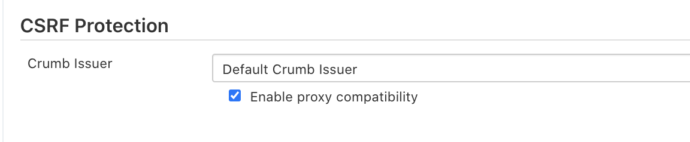
*Figure 3. Configure Global Security*

## Configure Jenkins Kubernetes Cloud

- Navigate: Manage Jenkins → Manage Nodes and Clouds → Configure Clouds
- Click: Add a new cloud → select Kubernetes from the drop menus

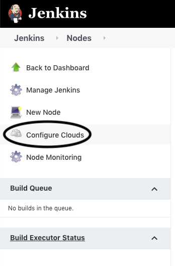

*Figure 4a. Jenkins Configure Nodes & Clouds*

*Note: Before proceeding, please ensure that you can access your Amazon EKS cluster information, whether it is through Console or CLI.*

- Enter a Name in the Kubernetes Cloud configuration field.
- Enter the Kubernetes URL which can be found via AWS Console by navigating to the Amazon EKS service and locating the API server endpoint of the cluster, or run the command `kubectl cluster-info`.
- Enter the namespace that will be utilized in the Kubernetes Namespace field. This will determine where the dynamic kubernetes pods will spawn. In our case, the name of the namespace is `jenkins`.
- During the initial setup of Jenkins Manager on kubernetes, there is an environment variable `JENKINS_URL` that automatically utilizes the Load Balancer URL to resolve requests. However, we will resolve our requests locally to the cluster IP address.
  - The format is as follows: `https://<service-name>.<namespace>.svc.cluster.local`

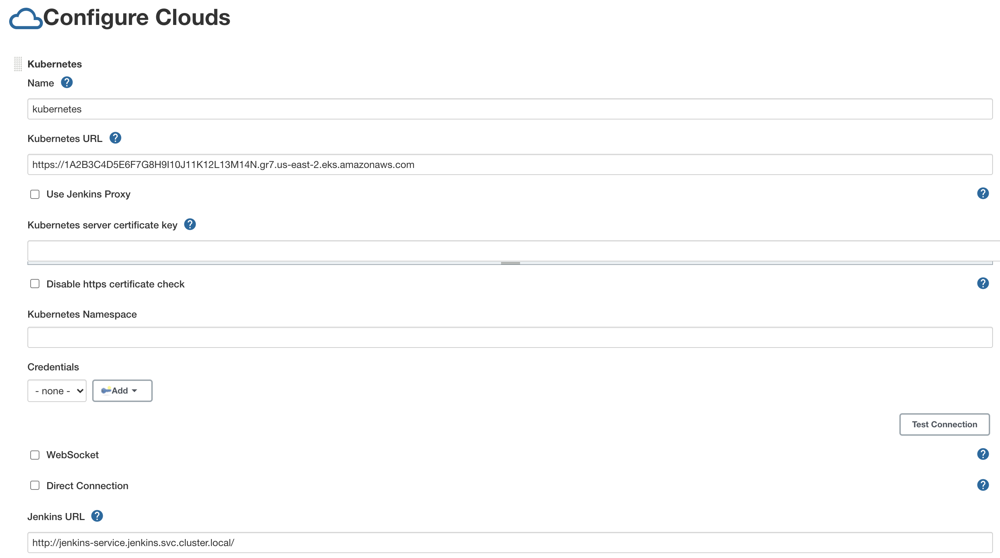
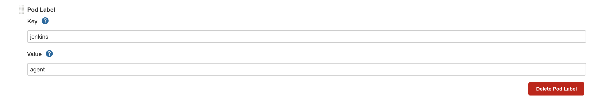
*Figure 4b. Configure Kubernetes Cloud*

## Set AWS Credentials

Security concerns are a key reason why we’re utilizing an IAM role instead of access keys. For any given approach involving IAM, it is the best practice to utilize temporary credentials.

- You must have the AWS Credentials Binding Plugin installed before this step. Enter the unique ID name as shown in the example below.
- Enter the IAM Role ARN you created earlier for both the ID and IAM Role to use in the field as shown below.

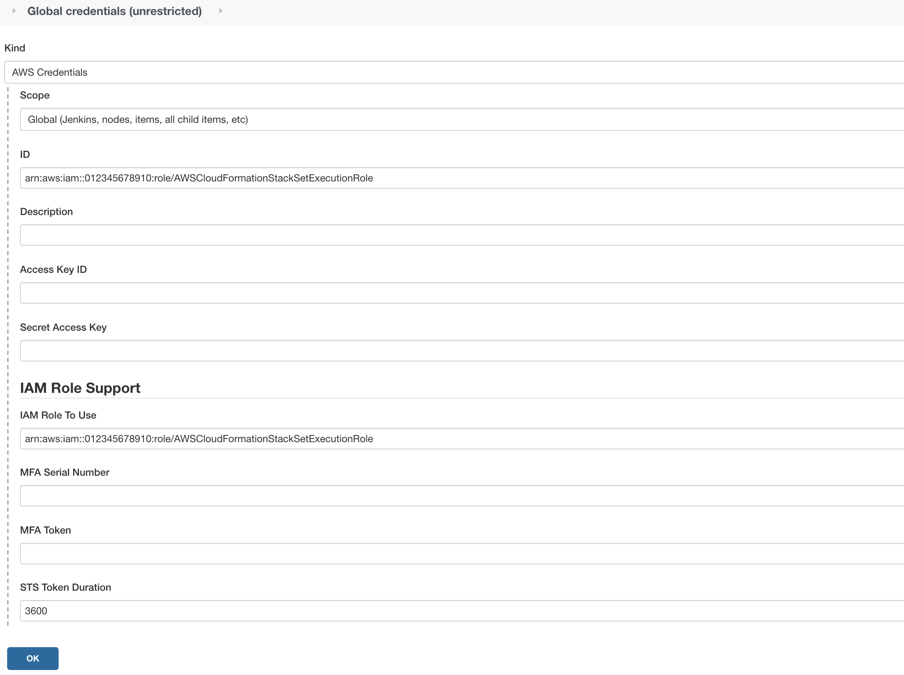
*Figure 5. AWS Credentials Binding*

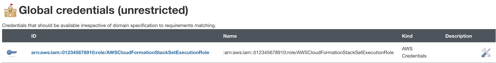
*Figure 6. Managed Credentials*

## Create a pipeline

- Navigate to the Jenkins main menu and select new item
- Create a Pipeline

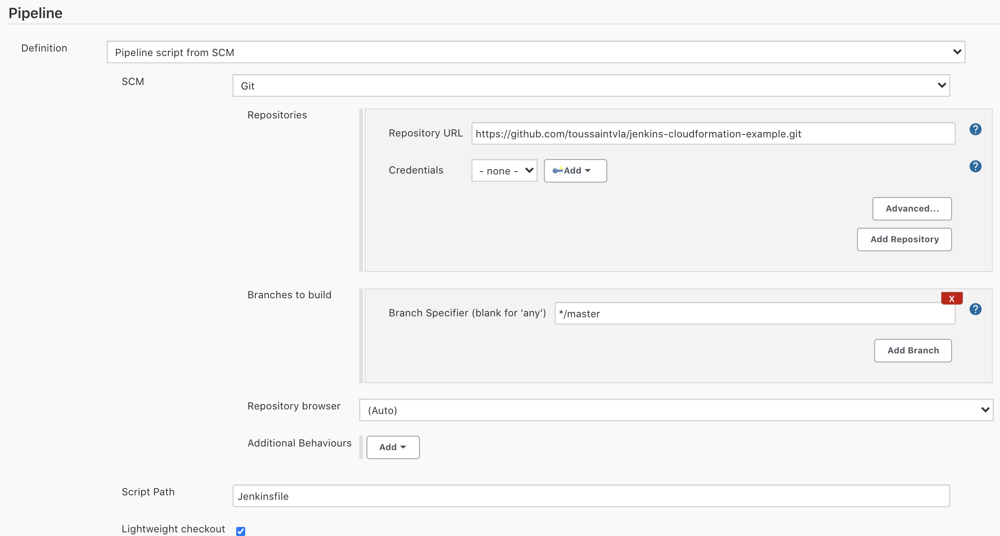
*Figure 7. Create a Pipeline*

## Configure Jenkins Agent

Setup a Kubernetes YAML template after you’ve built the agent image. In this example, we will be using the [k8sPodTemplate.yaml](https://github.com/aws-samples/jenkins-cloudformation-deployment-example/blob/main/k8s/k8sPodTemplate.yaml) file stored in the `k8s/` folder.

- [Configure Jenkins Agent k8s Pod Template](https://github.com/aws-samples/jenkins-cloudformation-deployment-example/blob/main/AGENT.md)

## CloudFormation Execution Scripts

This [deploy-stack.sh](https://github.com/aws-samples/jenkins-cloudformation-deployment-example/blob/main/scripts/deploy-stack.sh) file can accept four different parameters and conduct several types of CloudFormation stack executions such as deploy, create-changeset, and execute-changeset. This is also reflected in the stages of this [Jenkinsfile](https://github.com/aws-samples/jenkins-cloudformation-deployment-example/blob/main/Jenkinsfile) pipeline. As for the [delete-stack.sh](https://github.com/aws-samples/jenkins-cloudformation-deployment-example/blob/main/scripts/delete-stack.sh) file, two parameters are accepted, and, when executed, it will delete a CloudFormation stack based on the given stack name and region.

- [Understanding Pipeline Execution Scripts for CloudFormation](https://github.com/aws-samples/jenkins-cloudformation-deployment-example/blob/main/JENKINS.md)

## Jenkinsfile

In this [Jenkinsfile](https://github.com/aws-samples/jenkins-cloudformation-deployment-example/blob/main/Jenkinsfile), the individual pipeline build jobs will deploy individual microservices. The `k8sPodTemplate.yaml` is utilized to specify the kubernetes pod details and the inbound-agent that will be utilized to run the pipeline.

- [Jenkinsfile Parameterized Pipeline Configurations](https://github.com/aws-samples/jenkins-cloudformation-deployment-example/blob/main/JENKINS.md)

## Jenkins Pipeline: Execute a pipeline

- Click Build with Parameters then select a build action.

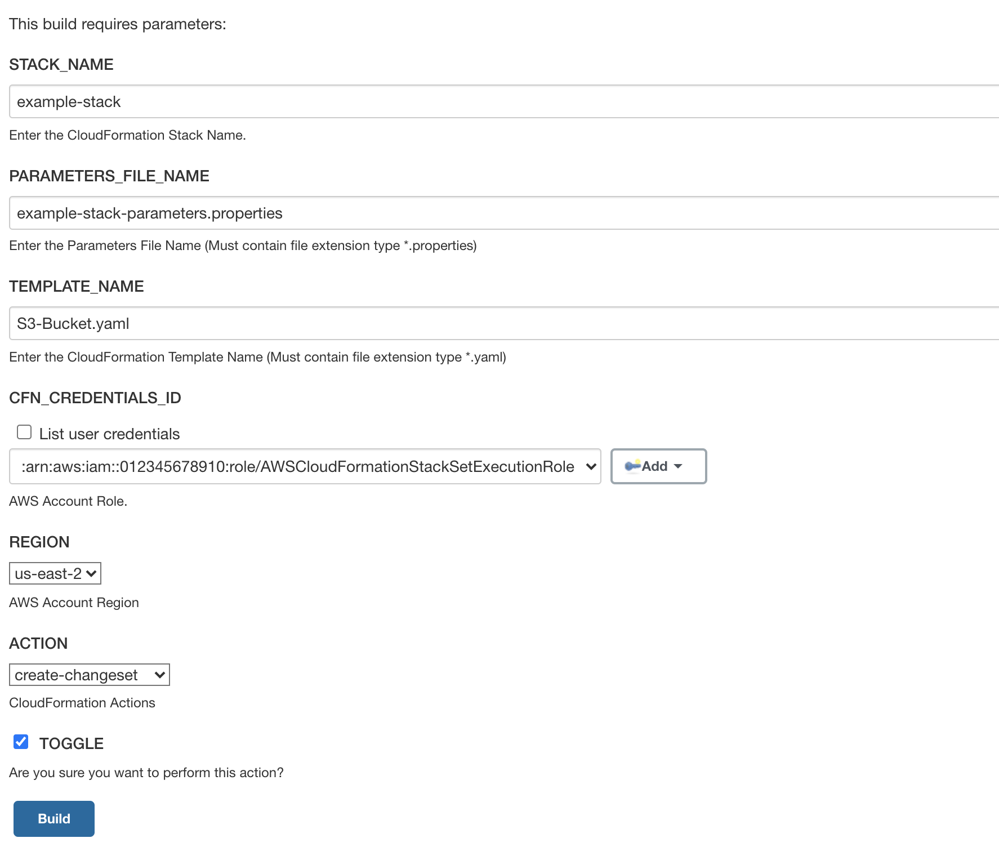
*Figure 8a. Build with Parameters*

- Examine the pipeline stages even further for the choice you selected. Also, view more details of the stages below and verify in your AWS account that the CloudFormation stack was executed.

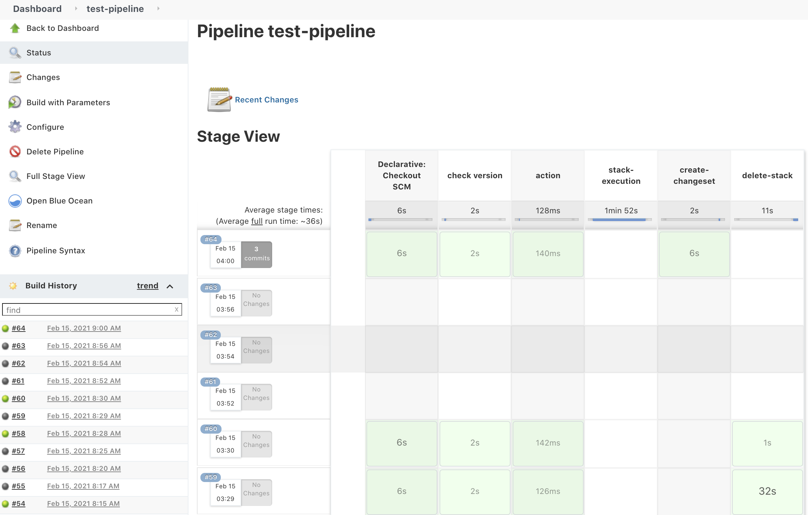
*Figure 8b. Pipeline Stage View*

- The Final Step is to execute your pipeline and watch the pods spin up dynamically in your terminal. As is shown below, the Jenkins agent pod spawned and then terminated after the work completed. Watch this task on your own by executing the following command:

```bash
# Watch the pods spawn in the "jenkins" namespace
~ kubectl get pods -n jenkins -w
```

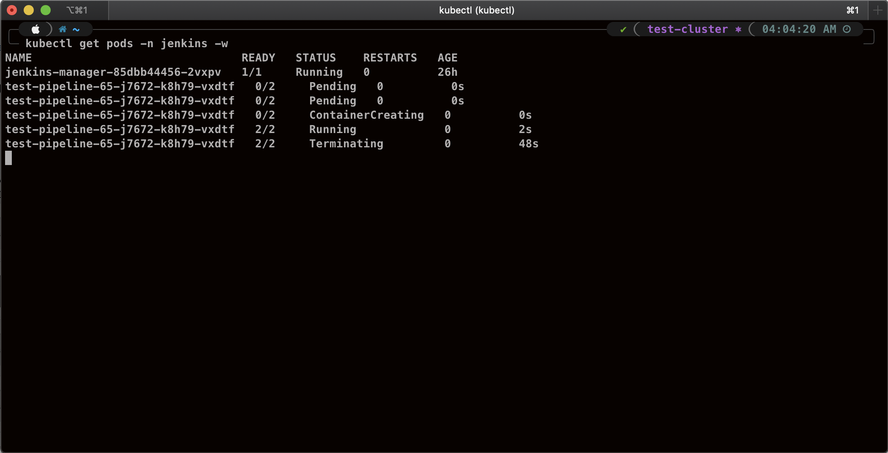
*Figure 9. Watch Jenkins Agent Pods Spawn*

## Code Repository

- [Amazon EKS Jenkins Integration](https://github.com/aws-samples/jenkins-cloudformation-deployment-example.git)

## References

- [Jenkins Kubernetes Plugin](https://plugins.jenkins.io/kubernetes/)
- [CloudBees AWS Credentials Plugin](https://plugins.jenkins.io/aws-credentials/)

## Conclusion

This post broke down the process of building out Amazon EKS and integrating Jenkins to orchestrate workloads. We demonstrated how you can utilize this to deploy securely in multiple accounts with dynamic Jenkins agents and create alignment to your business with similar use cases. To learn more about Amazon EKS, see our [documentation](https://aws.amazon.com/eks/getting-started/) pages or explore our [console](https://console.aws.amazon.com/eks/home?region=us-east-1#).
